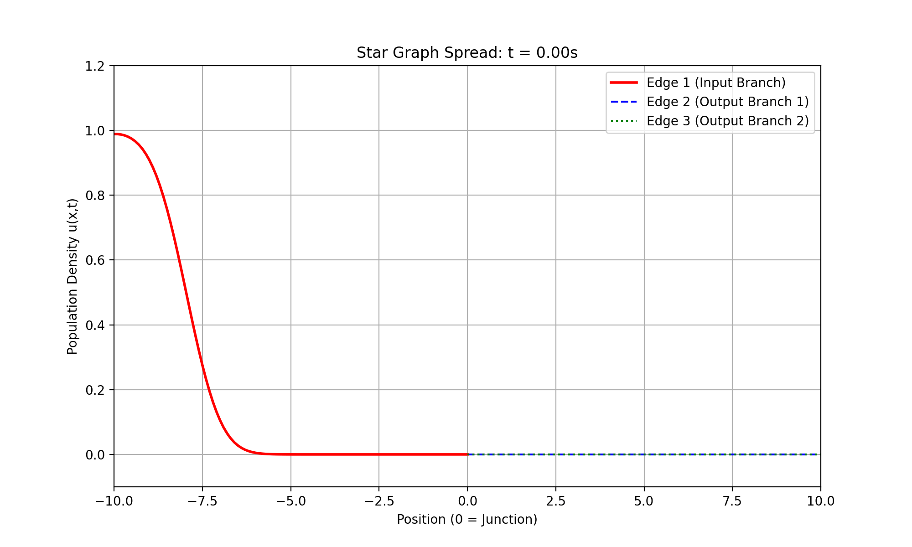

# Numerical Modeling of Fisher-KPP Equations on Metric Graphs

This project implements a numerical solver for the **Fisher-KPP reaction-diffusion equation** on network structures (metric graphs). It explores how network geometry and edge heterogeneity influence population spreading dynamics, simulating scenarios relevant to biological invasions and cell migration.

## Overview

The Fisher-KPP equation is a fundamental model in mathematical biology combining **diffusion** (spread) and **logistic growth** (reaction):

$`\frac{\partial u}{\partial t} = D \frac{\partial^2 u}{\partial x^2} + r u(1-u)`$

While typically studied on infinite lines, this project solves the equation on a **Star Graph** (a central junction connecting multiple edges), requiring the implementation of **Kirchhoff vertex conditions** to ensure mass conservation at the nodes.

### Key Features
* **Explicit Finite Difference Scheme:** Implemented a stable numerical solver using forward Euler time-stepping.
* **Graph Operations:** Handles wave propagation across a junction node (Star Graph topology).
* **Heterogeneity Modeling:** Simulates edges with different diffusion coefficients ($D$) to demonstrate asymmetric spreading speeds.
* **Visualization:** Real-time dynamic plotting of population density $`u(x,t)`$.

---

## Results & Simulation

### 1. Traveling Wave Solution (1D Baseline)
Before moving to graphs, the solver was validated on a single 1D domain. The simulation correctly reproduces the characteristic traveling wave front with constant speed $c = 2\sqrt{Dr}$.


### 2. Spreading on a Star Graph
The population starts at the far end of an input branch and spreads through a central junction into two output branches.

#### Case A: Symmetric Spreading
When all edges have identical properties ($`D=1.0`$), the population splits equally at the junction.


#### Case B: Effect of Heterogeneity (Broken Symmetry)
Here, one output branch (Green) has a lower diffusion coefficient ($`D=0.5`$) than the other (Blue, $`D=1.0`$).


**Observation:** As seen in the plot above, the wave on the "slow edge" (Green) lags significantly behind the "fast edge" (Blue). This aligns with the theoretical wave speed relation $`c \propto \sqrt{D}`$.

---

## How to Run
1. Clone the repository.
2. Run the star graph simulation:
   ```bash
   python star_graph.py
   ```

3. Modify the diffusion coefficient `self.D3` in the code to experiment with different network properties.

---

## Numerical Methods

The spatial domain is discretized using a grid with step size $` \Delta x`$. The Laplacian is approximated via the central difference scheme. The junction condition is handled by enforcing continuity and flux conservation:
$` \sum_{j \in \text{edges}} \frac{\partial u_j}{\partial x} \bigg|_{node} = 0 `$

In the discretized model with uniform grid spacing, this implies the node value is the average of its nearest neighbors.
